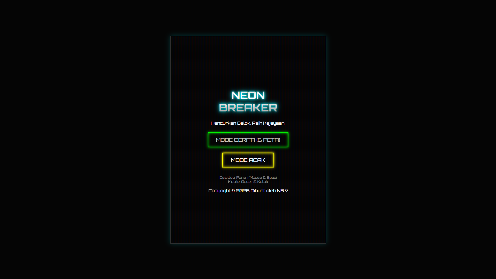

# Neon Brick Breaker 🧱⚡

Game arcade klasik "Breakout" yang dibangun kembali dengan estetika neon modern, efek partikel, dan audio sintetis tanpa ketergantungan file eksternal.

## 🎮 Fitur Utama

- Single File HTML: Tidak perlu instalasi, cukup unduh dan mainkan di browser apa saja.
- Visual Neon Modern: Desain futuristik dengan efek glow, font 'Orbitron', dan efek scanline CRT halus.
- Dua Mode Permainan:
   - Campaign: 6 Level unik dengan pola berbeda (Zigzag, Piramida, Benteng, Alien Boss).
   - Random (Endless): Peta dihasilkan secara prosedural (acak) untuk tantangan tanpa batas.
- Audio Offline: Efek suara dibuat secara real-time menggunakan Web Audio API (tanpa file mp3 eksternal yang memberatkan).
- Responsif: Mendukung kontrol Mouse/Keyboard (Desktop) dan Touchscreen (Mobile/Tablet).
- Sistem High Score: Menyimpan skor tertinggi Anda secara lokal di browser.

## 🕹️ Cara Bermain

Tujuan permainan adalah memantulkan bola menggunakan paddle untuk menghancurkan semua balok di layar tanpa membiarkan bola jatuh ke bawah.

Kontrol Desktop (PC/Laptop)
- Gerakan Paddle: Geser Mouse atau gunakan tombol Panah Kiri / Kanan pada keyboard.
- Mulai / Tembak Bola: Tekan Spasi atau klik kiri mouse (jika bola menempel).
- Pause Game: Tekan tombol Spasi saat permainan berlangsung atau klik tombol Pause di pojok kanan atas.

Kontrol Mobile / Tablet
- Gerakan Paddle: Sentuh layar dan geser jari ke kiri atau kanan.
- Mulai / Tembak Bola: Ketuk (Tap) layar satu kali.

## 🚀 Cara Menjalankan

Karena game ini dibuat dalam satu file HTML mandiri, cara menjalankannya sangat mudah:

1. astikan Anda memiliki file game.html.
2. Klik dua kali file tersebut, atau Klik Kanan -> Open With (Buka Dengan).
3. Pilih browser modern favorit Anda (Google Chrome, Mozilla Firefox, Microsoft Edge, atau Safari).
4. Game siap dimainkan!

## 🛠️ Teknologi di Balik Layar

Game ini dibuat murni menggunakan teknologi web standar tanpa framework game engine berat:
- HTML5 Canvas: Digunakan untuk me-render grafis 60 FPS yang mulus.
- Vanilla JavaScript: Mengatur logika fisika bola, deteksi tabrakan, dan AI musuh (jika ada).
- CSS3: Mengatur tampilan antarmuka (UI) dan efek cahaya neon.
- Web Audio API: Menghasilkan suara synthesizer retro secara langsung dari kode.
- Local Storage: Menyimpan data High Score pengguna di browser.
Selamat menikmati tantangan Neon Brick Breaker!